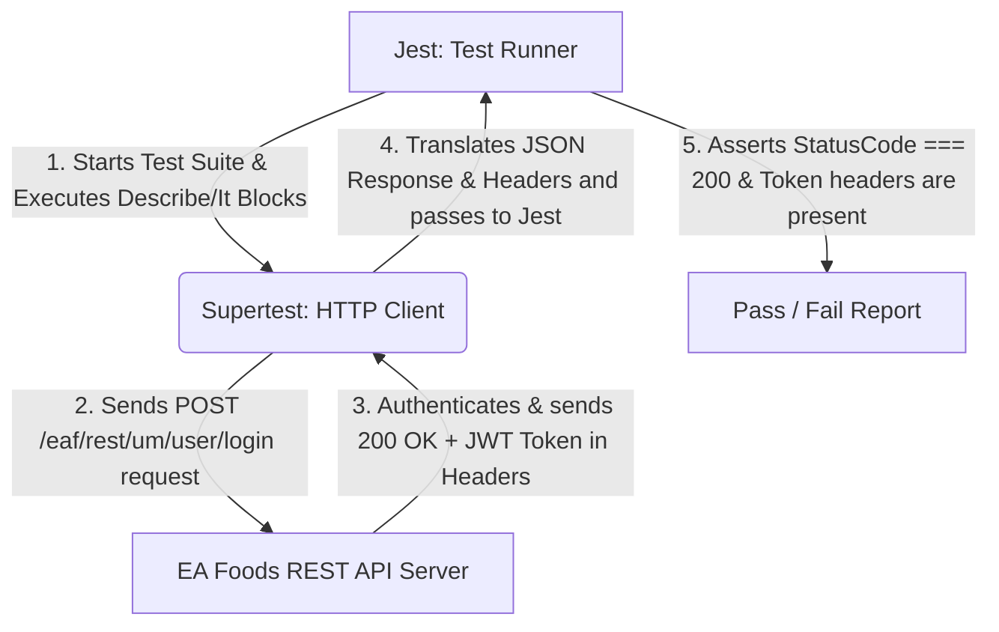

# EA Foods REST API Automation Testing Demo: Jest + Supertest

Welcome! This is a beginner-friendly demo project designed to introduce manual QA engineers to the world of API automation testing. We use **Node.js** as our runtime, **Jest** as our test runner and assertion library, and **Supertest** to execute HTTP requests.

In this demo, we test the login API for the **EA Foods DEV environment**.

---

## 📂 Project Directory Structure

Here is how the project is structured:

```text
api-demo/
├── package.json         # Node.js project file defining metadata, dependencies, and test scripts
├── jest.config.js       # Jest configuration file (environment, timeouts, file matching)
├── README.md            # This manual (onboarding, setup, and key concepts)
└── tests/               # Folder where all our automated test files live
    └── login.test.js    # Our sample login test suite containing tests for success and failure
```

---

## 🛠️ Step-by-Step Setup & Installation

### Step 1: Open Terminal in the `api-demo` Folder
Open your terminal (PowerShell, Command Prompt, or terminal inside VS Code) and navigate to the directory where this demo is located:
```bash
cd api-demo
```

### Step 2: Install the Packages
Run the following command to download and install the required dependencies:
```bash
npm install
```
> **What this does:** It reads the `devDependencies` section in `package.json` and downloads `jest` and `supertest` into a new folder called `node_modules`.

### Step 3: Run the Tests
To execute our test suite, run:
```bash
npm test
```
> **What this does:** It runs the `jest` command configured inside `package.json`. Jest scans the `tests/` directory, runs `login.test.js`, executes the assertions, and prints the result.

---

## 🧪 Demo API Credentials (EA Foods)

We target **EA Foods DEV** (`https://dev.eafoods.com`).

*   **Valid Credentials:**
    *   **Email ID:** `admin@eafoods.com`
    *   **Password:** `Qwerty123$`
*   **Invalid Credentials:**
    *   **Email ID:** `admin@eafoods.com`
    *   **Password:** `wrongpassword`

---

## 🧠 Key Concepts: How Jest + Supertest Work Together

When automation developers talk about tools, they separate them by **responsibilities**. In this project, Jest and Supertest play two different, yet highly cooperative roles:



### 1. Jest (The Coordinator & Judge)
* **What is it?** A testing framework developed by Meta (Facebook).
* **Role in this project:**
  * **Runner:** It finds and executes our test files.
  * **Structure:** It provides functions like `describe()` to group tests, and `it()` to define individual test cases.
  * **Assertions:** It provides the `expect()` function to evaluate whether our results match our expectations. For example: `expect(status).toBe(200);`

### 2. Supertest (The Messenger)
* **What is it?** A lightweight library specifically made for making HTTP requests (GET, POST, PUT, DELETE) and testing their responses.
* **Role in this project:** It acts as our HTTP client. It builds the request payload, sends it to the target server, and retrieves the response headers and body.

### 3. Understanding the Flow: Request, Response, and Assertions
* **Request:** The information we send to the server (HTTP method like POST, URL, headers, and the payload/body).
* **Response:** What the server returns to us (HTTP Status code, response headers, and response body).
* **Assertions:** Checks we make to confirm the response matches expectations. If any assertion fails, the test fails.

---

## 💡 Transition Guide for Manual QA Engineers

If you are transitioning from manual API testing (using tools like Postman or Swagger UI), here is how your manual process translates directly into automation:

### 1. UI Testing vs. API Testing

| Feature | UI Testing (e.g., Selenium, Playwright) | API Testing (e.g., Jest + Supertest) |
| :--- | :--- | :--- |
| **Target** | User Interface (Buttons, inputs, pages) | Data Layer (Endpoints, payloads, status codes) |
| **Speed** | Slow (requires browser startup and rendering) | **Extremely Fast** (takes milliseconds to execute) |
| **Stability** | Flaky (UI elements change frequently) | **High Stability** (contracts/APIs rarely change) |
| **Feedback Loop** | Late (requires complete application build) | **Early** (can test backend logic before UI is built) |

### 2. Why Supertest is useful for backend/API testing
* **Syntactic Sugar:** Supertest allows you to chain commands (e.g., `.post('/login').send(data).expect(200)`), making tests highly readable.
* **No Server Setup Needed:** Supertest can test active remote web servers or mount local Node.js Express/Koa apps directly without starting them on a network port.
* **JSON support:** It parses JSON responses automatically so we can immediately assert on JavaScript objects.

### 3. Advantages of Automation over Manual API Testing
1. **Repeatability & Regression:** A human tester can take 1-2 minutes to test one login scenario manually. An automated suite runs 100 scenarios in seconds.
2. **CI/CD Integration:** You can set these tests to run automatically every time a developer commits code. If they break something, they find out instantly.
3. **Data-Driven Tests:** You can easily run the same test case with 50 different invalid usernames/passwords using a simple loop. Doing this manually is tedious.
